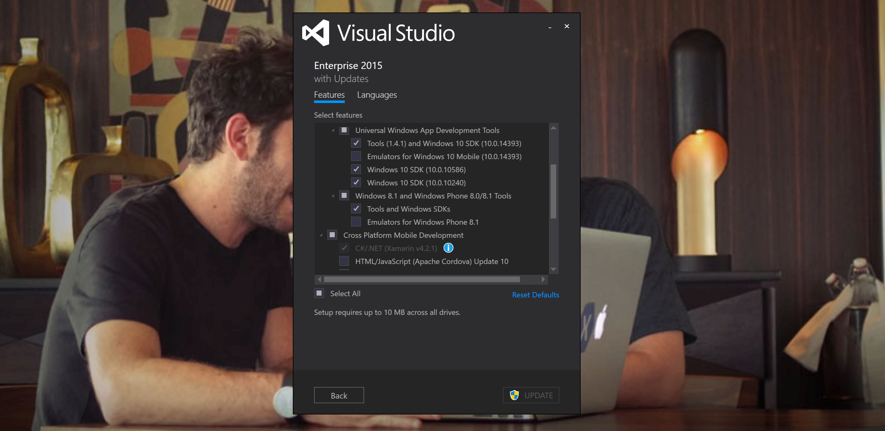
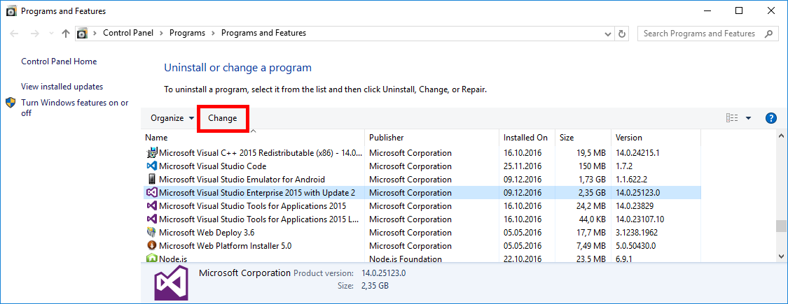

# Setting up
Actually, the setup of a working Xamarin environment can get a little bit tricky and time consuming as so many different SDKs and technologies from different companies have to intertwine.

You can absolutely both, **Windows 10 or OSX/macOS** to develop Xamarin applications. Both is fully supported and you can choose which fits you personal preferences most. As Visual Studio on Windows is the richest IDE, we will use it for this workshop, but you can do everything on Mac aswell.

## Install Xamarin
Installing Xamarin should be easy but the process varies on the different platforms. We will go through both processes together.

### On Windows
When working on Windows, [Visual Studio](https://www.visualstudio.com/downloads/) will be the right IDE for you. You can check if you have a license for the paid versions or even go with the free Community Edition. Both will work for you.

You can select Xamarin from the ***Features*** list in the Visual Studio installer. Make sure, that the following features get installed:
- Windows and Web Development
  - Universal Windows App Development Tools
    - Tools and Windows 10 SDK
    - Windows 10 SDK
  - Windows 8.1 and Windows Phone 8.0/8.1 Tools
    - Tools and SDKs
- Cross Plaform Mobile Development
  - C#/.NET (Xamarin)
  - Microsoft Visual Studio Emulator for Android (optional)
  - Common Tools and Software Development Kits
    - Android Native Development Kit (T10E, 32 bits)
    - Android SDK
    - Android SDK Setup (API Level 19 and 21)
    - Android SDK Setup (API Level 23)
    - Java SE Development Kit

> **Hint:** If you already have Visual Studio installed, you can modify its features via the ***Programs and Features*** tool at the ***Control Panel***. Locate *Microsoft Visual Studio* there and click the <kbd>Modify</kbd> button to rerun the installer.
> 
> 

### On Mac
On a Mac, Xamarin needs to be installed differently. [Download the installer](https://www.xamarin.com/download) and run it. It should install all Xamarin components you need, including the Android SDK and Xamarin Studio, which will be your IDE on OSX/macOS.

## Prepare the Android development
### Android SDK
Both ways of installing Xamarin for Mac or Windows should install the Android SDK automatically. If anything goes wrong, you can also [download it from the Google Developer portal](https://developer.android.com/studio/index.html).

### Android Emulator
To test your Android apps, you might need an emulator. You can use any emulator you like, for example 
  - [Android Emulator for Visual Studio](https://www.visualstudio.com/vs/msft-android-emulator/) on Windows
  - Google Emulator that comes with [Android Studio](https://developer.android.com/studio/index.html)
  - [Genymotion](https://www.genymotion.com/#!/)

## Prepare the iOS development
### iOS SDK and Simulator
To work with iOS, you need a Mac (at least anywhere in your network) with [Xcode](https://itunes.apple.com/de/app/xcode/id497799835?mt=12) installed. By default, this will install the latest iOS SDK and several simulators. You have to start Xcode at least once shortly, to initialize everything.

### Mac Build Host for Windows
When working on a Windows maching and using the Mac only as a Remote Build Host, you have to connect it with Visual Studio.

Click on <kbd>Tools</kbd> <kbd>Options...</kbd>, scroll down to the ***Xamarin*** section and click on ***iOS Settings*** to navigate to the configuration window. Here you can click on <kbd>Find Xamarin Mac Agent</kbd> to conenct you Mac. Follow the steps from the wizard to establish the connection.

### Remote iOS Simulator for Windows
Here you can also select the *Remote iOS Simulator* on Windows. If you check this, the iOS Simulator from the Mac will be streamed to your Windows machine and you can test your app there.

## Prepare the Universal Windows development
### UWP SDK and Emulators
The Windows 10 (UWP) SDK has also be installed with Visual Studio. If you have not selected it while installing Visual Studio, follow the same process as above. Open the ***Programs and Features*** window, select ***Visual Studio*** and click <kbd>Modify</kbd> to add new features.

Here you can select the ***Universal Windows App Development Tools** you want to install as well as Emulators for mobile. Remember, that you don't mandatory need Windows 10 Mobile Emulators, as you can run the same app package also in Windows 10 itself.

## Test your configuration
To test you development environment, you can download the simple blank test app that is [attached to this module](/Setup%20Test%20App) and try to run it on all platforms you want to target. If you run in any errors, head over to the [Troubleshooting](../Troubleshooting) section and check if your problem can be resolved easily.

1. Open the Solution by double-clicking on the `XamarinSetupTest.sln` file and wait until your IDE spins up.
1. Right-click on the Solution name at the top of the folder structure and select <kbd>Restore NuGet Packages</kbd> to download the packages
1. Wait until all packages have been restored
1. Android
    1. Right-click the ***XamarinSetupTest.Droid*** project, select <kbd>Set as StartUp Project</kbd>
    1. Make sure the Run settings at the topbar are *Debug*, (*Any CPU*) and a Android Emulator is selected
    1. Click the green ***Run*** button
    1. An Android Emulator should spin up and launch the app
1. iOS
    1. Only on Windows: Make sure that the Remote Mac Build Host is connected as shown above
    1. Right-click the ***XamarinSetupTest.iOS*** project, select <kbd>Set as StartUp Project</kbd>
    1. Make sure the Run settings at the topbar are *Debug*, *iPhone Simulator* and a iOS Simulator is selected
    1. Click the green ***Run*** button
    1. An iOS Simulator should spin up and launch the app
1. Windows
    1. Make sure you opened the Solution on Windows as OSX/macOS can not build Windows apps
    1. Right-click the ***XamarinSetupTest.UWP*** project, select <kbd>Set as StartUp Project</kbd>
    1. Make sure the Run settings at the topbar are *Debug*, *Any CPU* and *Local Machine* is selected
    1. Click the green ***Run*** button
    1. The app should be launched

## Move on
If this works for the platforms you want to target, you are ready to move on. This was the hardest part. Now you can discover the beautiful world of Xamarin!