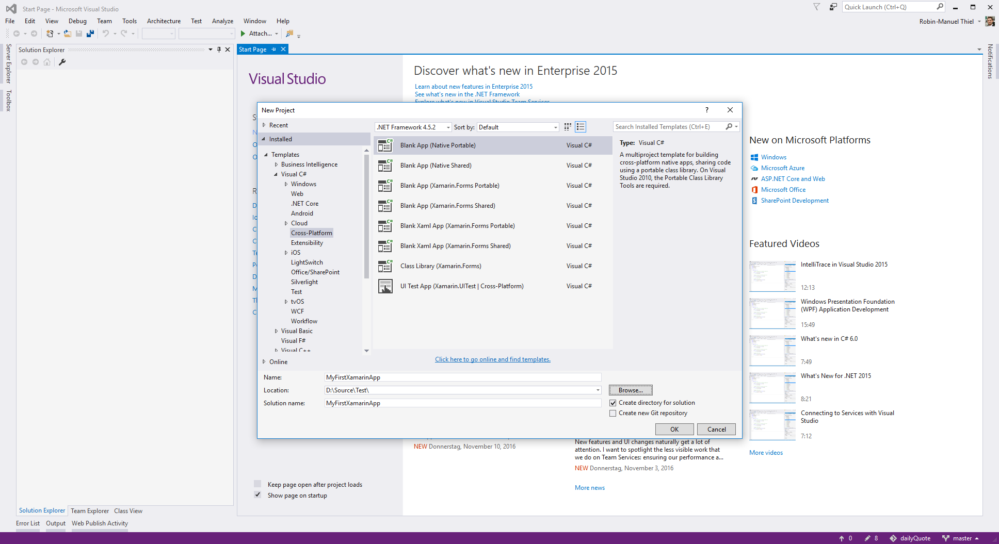
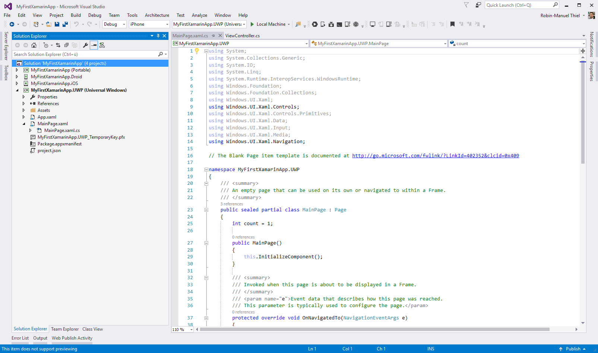
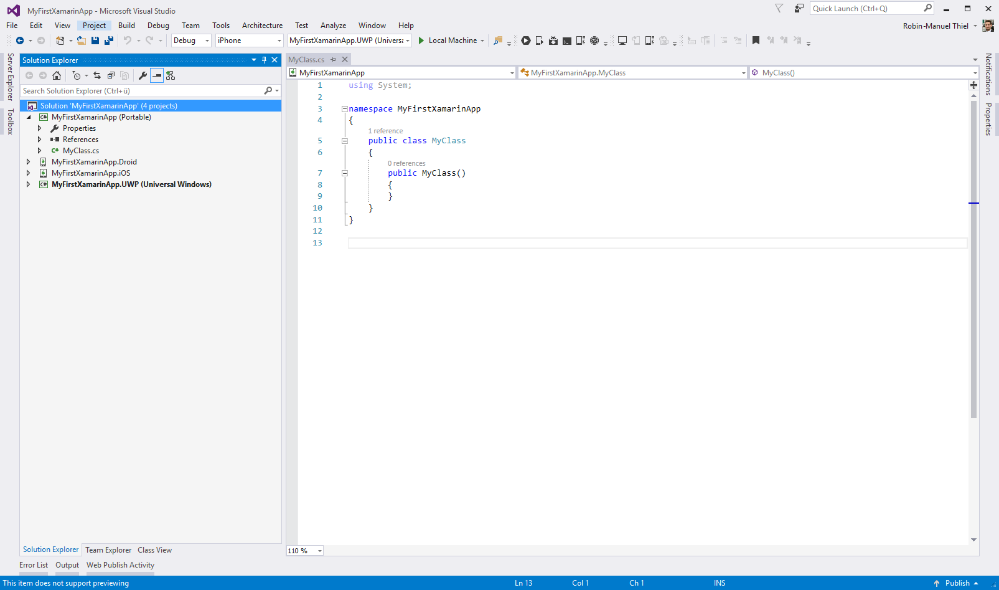

# Creating a Xamarin Platform App
Creating a Xamarin application is super simple, as Visual Studio does all the work for us. While installing, Xamarin creates Visual Studio templates, that contain everything we need to start coding for iOS, Android and Windows. Make sure, to setup your development environment correctly before starting to create Xamarin apps, as described in module [02 Setting up](/02%20Setting%20up).

In this module, we will create a Xamarin Plaform App, not a Xamarin.Forms one. This makes a huge difference and the naming is a little bit clumsy, so let's clear it first.

**What does *Xamarin Platform* mean?**

In general, Xamarin takes iOS, Android and Windows to the same developing technology (.NET) to makes it easier to develop for all three platforms at the same time and with the same team while enabling to share code snippets across all of these projets. This still means, that we will have a dedicated project for each platform and have to create layout and code for each platform. The main difference in the unifiend development language.

Xamarin.Forms often gets mistaken for Xamarin Platform and extends the concept by providing a unified UI technology with up- and downsides. In a real-world scenario, you have to choose carefully between these concepts. If you are not sure, what to use, I would always recommend Xamarin Platform, as it is a much cleaner and more powerful approach!

Enough theory for now. Let's create our first app!

## Creating the App
To create a new Xamarin app, simply click on <kbd>File</kbd> <kbd>New</kbd> <kbd>Project...</kbd> and navigate to the ***Cross-Platform*** section in the upcoming window. Here you will see a bunch of project templates. Select the ***Blank App (Native Portable)*** one, which creates a Xamarin Platform app for you, that shares its code in a [Portable Class Libary](https://msdn.microsoft.com/en-us/library/gg597391(v=vs.110).aspx).

As Visual Studio is creating multiple projects at once now, this process might take some seconds. When finished, you will the a new *Solution* with four different projects. One for each platform and one for the shared code. We will walk through all of these in this module. 

## The Android project
When creating a cross-platform application, Xamarin creates a YourApp.**Droid** project for you, which is based on Xamarin.Android.

If you are familiar with Android Development in Android Studio and Java, the content will look very firm for you. You will find a `MainActivity.cs` file, which is the first entry point of your Android app and has the same lifecycle methods and functions that any Java app, but just in C#.

Xamarin maps the existing Java Android API 1:1 to C# and all the methods and procedures are exactly the same.

> **Important:** That means that you can reuse nearly all of your existing Android skills. You don't have to learn anything new about the platform it is just the language that changes. Even if you run into a problem and find a Java solution for it on the web, you can simply translate it into C# and it will work for you!

You will also find a layout file `Main.axml` where every Android developer would expect it: The ***Resources*** folder. Xamarin does not touch these layout files, sothat you can reuse 100% of your existing Android Layout code in the Xamarin project.

## The iOS project
The iOS project that gets created is based on Xamarin.iOS and will be called YourApp.**iOS**. It works very similar to the Android project.

You will find every class you would expect when creating a Swift or Objective-C iOS project in Xcode, but mapped to C#. So you will find an `AppDelegate.cs` file as an iOS developer would expect it with all the lifecycle methods you might be firm with.

Again, the layout file is not getting touched by Xamarin. It still uses Storyboards and .xib files for layouting and does not have any Xamarin or C# specifics in there.

## The Windows project
Actually, the Windows project has nothing to do with Xamarin and is nothing special. It is a UWP application without any modifications and plain as every Windows developer knows it.

The fact that is already runs on .NET and uses C# in most cases lets it also benefit from the code-sharing. It does not have to get ported to C# because **it already is** there.

So from a framework perspective, iOS and Android has been ported to the same technology stack that Windows apps already were on sothat they can work together seamlessly.

## The Portable project
The most exciting project might be the Portable Class Library that Xamarin created. All platform projects are referencing this library. This implies that everything that gets created in here, is available for every platform.

This gets very important, when it comes to code-sharing across multiple platform. This project is there place where as much code as even possible should live.

The Portable project is the perfect place for your

- Models
- ViewModels
- Interfaces, that have to be implemented by the platform
- Services, that are platform independant

Every time, we add a new functionality to our solution, we should consider if it could be placed into this portable library as it makes **Maintaining**, **Testing**, **Bugfixes** and **Code Reuse** much easier!

> **Important:** Being able to placing code here wich becomes available for every other platform is the real benefit of Xamarin!

## Running the App
To run the app either in an Emulator, Simulator or physical device, you need to select at least one platform as StartUp project. For this, right-click on one of the platform projects and select <kbd>Set as StartUp Project</kbd>.

Now you can configure the Run Configurations for your app and select **Debug** or **Release** mode, **Architecture Model** and **Target Device** at the topbar of Visual Studio.

When testing you app on iOS, I have to make sure that my machine is connected to a **Mac Build Host**. Then I can select **iPhone** or **iPhone Simulator** as Architecture Model and run the app on a Simulator or physical device.

To start the application, simply hit the **Run button** with the green play symbol. Now the compilation and deployment starts and your application will be launched.